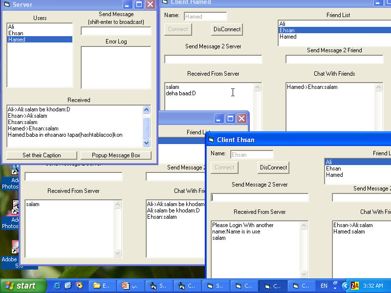



## Chat Server\(Multi TCP\)

### Description

Chat aplications are widely used nowadays.

a complete chat server with options ,login to server,retrieving other friend names,going online or offline,... just like real chat programs.introduces us the basic knowledge that is used.

Download the code and compile it then run server

program.now you can run client program many times(at first you should make exe file).It is a multi client chat server with transfering data in both sides .

you can visit our electronics projects here:

www.ecerc.org/iutmicrobot

I expanded one psc code i downloaded

here:you can download the source here

http://planetsourcecode.com/vb/scripts/ShowCode.asp?txtCodeId=42546&lngWId=1

and then i improved it to be more usefull.soon I will make a code to login to yahoo using YMSG9.
 
### More Info
 

             |
---                |---
**Submitted On**   |2003-03-09 03:49:24
**By**             |[Ehsan Azarnasab](https://github.com/Planet-Source-Code/PSCIndex/blob/master/ByAuthor/ehsan-azarnasab.md)
**Level**          |Intermediate
**User Rating**    |4.3 (30 globes from 7 users)
**Compatibility**  |VB 5\.0, VB 6\.0
**Category**       |[Coding Standards](https://github.com/Planet-Source-Code/PSCIndex/blob/master/ByCategory/coding-standards__1-43.md)
**World**          |[Visual Basic](https://github.com/Planet-Source-Code/PSCIndex/blob/master/ByWorld/visual-basic.md)
**Archive File**   |[Chat\_Serve1561093172003\.zip](https://github.com/Planet-Source-Code/ehsan-azarnasab-chat-server-multi-tcp__1-44078/archive/master.zip)

